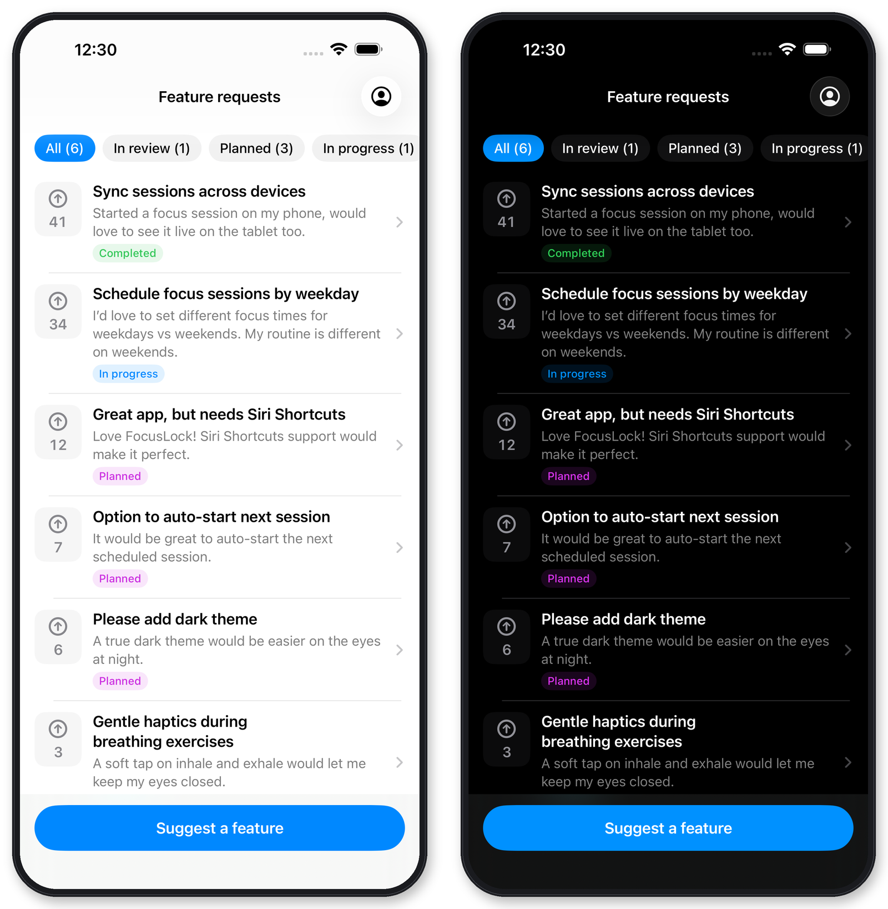

# FeedbackThread Swift SDK


Native in-app feedback for iOS: a drop-in feature-request board with voting, a feedback form, and automatic **"Shipped in x.y.z"** badges — all wired to your [FeedbackThread](https://feedbackthread.com) dashboard, roadmap, and AI-agent workflow.

- 🗳️ **Feature-request board** — moderated public requests with voting, status filters, and full-text detail views
- ✍️ **Feedback form** — bug reports and feature requests straight into your triage inbox
- 🚀 **Close the loop** — requests attached to a published release automatically show a *Shipped in x.y.z* badge to the people who asked
- 💎 **Paying-customer signal** — optionally tag submissions and votes with your paywall state so you can prioritize by revenue
- 🔒 **Privacy-first** — no email or name is required; you control whether to pass an external user identifier; anonymous voter IDs stay on-device
- 🪶 **Zero dependencies** — a small async/await client over `URLSession`, SwiftUI views, nothing else

## What your users see

`FeedbackThreadBoard` follows the system appearance out of the box:



## Requirements

- iOS 16+ (SwiftUI views) · macOS 13+ (client only)
- Xcode 16 / Swift 6

## Installation

In Xcode: **File → Add Package Dependencies…** and enter

```text
https://github.com/aivars/feedbackthread-swift.git
```

Choose **Up to Next Major Version** from `0.4.1` and add the `FeedbackThread` product.

## Quick start

Grab your project key from the dashboard (**SDK setup**). It's a public, low-privilege identifier — safe to ship in your binary. It can submit feedback, read the moderated request feed, and vote; it cannot touch your private dashboard data.

```swift
import FeedbackThread

let feedbackThread = FeedbackThreadClient(projectKey: "<your-project-key>")
```

Present `FeedbackThreadBoard` and you're done — it's the complete integration:

```swift
.sheet(isPresented: $showFeedbackThread) {
    FeedbackThreadBoard(
        client: feedbackThread,
        externalUserID: signedInUserID   // optional; anonymous ID used otherwise
    )
}
```

One view gives users a vote-sorted board of requests and bugs with status filters (In review · Planned · In progress · Completed) and **Shipped in x.y.z** badges, a **Suggest a feature** button that opens the submission form, and a **My requests** tab with an unread badge that closes the loop on their own cards — all built in.

### Tell FeedbackThread who pays

Pass the same signal you trust for your own paywall — it powers per-request "N paying customers want this" prioritization in the dashboard:

```swift
try await feedbackThread.submit(
    FeedbackThreadFeedbackSubmission(
        kind: .request,
        title: "iCloud sync",
        text: "Sync my data between iPhone and iPad.",
        customerTier: entitlements.isPro ? .paying : .free
    )
)
```

`customerTier` is `.free`, `.paying`, or `.custom("family")` — and omitted entirely when you don't pass it.

## Advanced: standalone surfaces

`FeedbackThreadBoard` is a complete integration on its own, but its pieces are also available individually for contextual placements — e.g. a "Report a bug" row in your settings screen that jumps straight to the form instead of the full board. Each surface below is fully supported as a standalone view.

### Show the feedback form

```swift
.sheet(isPresented: $showFeedback) {
    FeedbackThreadFeedbackForm(
        client: feedbackThread,
    )
}
```

Every submission carries an idempotency key, so a retried request never creates a duplicate.

### Show users their own requests

The board only ever shows moderated, public cards. `FeedbackThreadMyRequestsList` closes the loop for the person who submitted: it always shows their own cards, including ones still waiting for review that never appear anywhere public.

```swift
.sheet(isPresented: $showMyRequests) {
    FeedbackThreadMyRequestsList(
        client: feedbackThread,
        externalUserID: signedInUserID,   // optional; anonymous ID used otherwise
        onDismiss: { showMyRequests = false },
        onUnreadCountChange: { unreadCount in
            // badge your own UI, e.g. a tab item
        }
    )
}
```

It groups cards into **Waiting for review**, **In progress**, and **Shipped**, and auto-acknowledges shipped cards as soon as they're viewed.

`onUnreadCountChange` only fires once the list is opened — too late for a badge that should already be showing at launch. Call `myUpdates(externalUserID:)` yourself on app start or foreground to get `unreadCount` ahead of time:

```swift
.task {
    // Works for anonymous users too: resolve() returns the SDK's
    // persisted on-device ID when you don't pass your own.
    let userID = FeedbackThreadIdentity.resolve(externalUserID: signedInUserID)
    if let result = try? await feedbackThread.myUpdates(externalUserID: userID) {
        badgeCount = result.unreadCount
    }
}
```

The client exposes all three calls directly if you're building custom UI: `myRequests(externalUserID:)`, `myUpdates(externalUserID:)`, and `acknowledgeUpdates(ids:externalUserID:)`.

## Localization

The drop-in views ship in **English and Italian** and follow the device's
language automatically — nothing to configure. A locale the SDK doesn't carry
falls back to English.

All SDK-authored user-facing text lives in one String Catalog,
`Sources/FeedbackThread/Resources/Localizable.xcstrings`. Adding a language is a
pull request against that file and nothing else: open it in Xcode, add the
language, translate every key. A test fails if any key is left untranslated or
if a translation's format specifiers don't match the English ones.

Two things stay untranslated on purpose:

- **Server-supplied text** — request titles and descriptions, error messages
  from the API, and any request status the SDK doesn't recognize are passed
  through exactly as received.
- **Configuration errors** — `FeedbackThreadError.invalidConfiguration` messages
  are addressed to you while you wire the SDK up, not to your users.

`FeedbackThreadFeedbackKind.title` and `FeedbackThreadRequestTarget.title` remain
plain English `String`s, unchanged, for custom UI that already renders them.

### Use the client directly

The SwiftUI views are optional. `FeedbackThreadClient` exposes `submit(_:)`, `requests(externalUserID:)`, and `setVote(for:voted:externalUserID:customerTier:)` if you're building your own UI. Requests time out after a configurable `requestTimeout` (default 30 s).

## How it fits together

The SDK is the in-app half of FeedbackThread: feedback lands in a keyboard-driven triage inbox, becomes cards on your roadmap, ships in tracked releases — and your AI agent can work the whole backlog over [MCP](https://feedbackthread.com). Learn more at [feedbackthread.com](https://feedbackthread.com).

## Contributing

This repository is where the Swift SDK is developed, and pull requests are
merged here. See [CONTRIBUTING.md](CONTRIBUTING.md) for how to run the tests
(including the iOS simulator build that `swift test` does not cover) and for the
one invariant worth knowing before you touch status handling.

**Adding a language** is the easiest contribution: every user-facing string
lives in `Sources/FeedbackThread/Resources/Localizable.xcstrings`, and adding a
locale needs no Swift changes at all.

## License

MIT — see [LICENSE](LICENSE).
